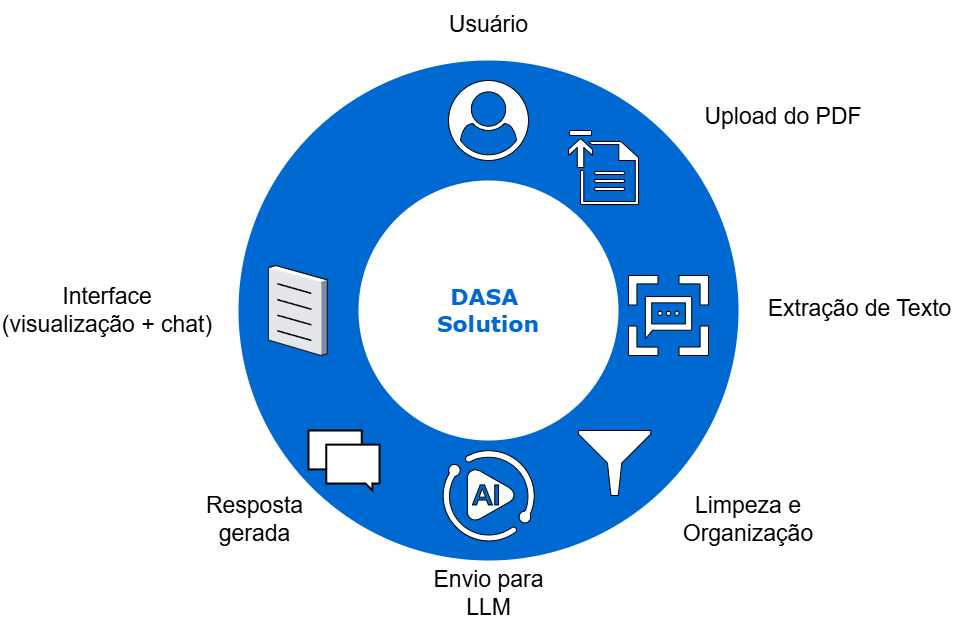

# FIAP - Faculdade de Informática e Administração Paulista

 

# Enterprise Challenge - SPRINT 1 - DASA

## Nome do grupo

# Integrantes: 
- <a href="https://www.linkedin.com/in/renanmendes26/">Renan de Oliveira Mendes - RM563145</a>
- <a href="https://www.linkedin.com/in/ricaleone/">Ricardo Batah Leone - RM563382</a>
- <a href="https://www.linkedin.com/in/yuki-watanabe-kuramoto-858856146/">Yuki Watanabe Kuramoto  - RM565164</a>
- <a href="https://br.linkedin.com/in/rodrigoreinaux/">Rodrigo De Melo Reinaux Porto  - RM564242</a>

# SOLUÇÃO PROPOSTA — GenReport Simplify

## 1. Visão Geral da Solução

O **GenReport Simplify** é uma aplicação que transforma relatórios genéticos em PDF em informações claras, acessíveis e interativas, utilizando Inteligência Artificial.

A solução permite que o usuário:

- Entenda seu exame em linguagem simples  
- Visualize um resumo dos principais riscos  
- Faça perguntas sobre seu próprio relatório  

Tudo isso sem exigir conhecimento técnico.

---

## 2. Compreensão do Problema de Negócio

O produto Genera oferece informações valiosas sobre o DNA do paciente, incluindo predisposições a doenças e características genéticas.

No entanto, os relatórios apresentam desafios importantes:

- Linguagem técnica complexa  
- Alto volume de informação  
- Formato estático (PDF)  
- Baixa interatividade  

### Impactos

- Dificuldade de interpretação pelo paciente  
- Baixa autonomia na tomada de decisão  
- Subutilização do potencial do exame  

---

## 3. Usuários da Solução

### Paciente (usuário principal)

- Quer entender seus resultados  
- Busca explicações simples  
- Deseja orientação prática  

### Médico (secundário)

- Apoio na interpretação rápida  
- Facilitação na comunicação com o paciente  

### Empresa (Dasa / Genera)

- Aumento do valor percebido do produto  
- Melhoria da experiência do cliente  

---

## 4. Identificação e Mapeamento dos Dados

Os relatórios em PDF contêm diferentes tipos de dados:

### Texto não estruturado

- Explicações científicas  
- Descrições de condições  

### Dados semi-estruturados

- Níveis de risco (baixo, médio, alto)  
- Tabelas simples  

### Estrutura típica

- Identificação do paciente  
- Seções temáticas:
  - Saúde  
  - Metabolismo  
  - Ancestralidade  

Para cada condição:

- Nome  
- Classificação de risco  
- Descrição  

---

## 5. Transformação dos Dados (PDF → Texto Organizado)

### Etapas do processamento

1. **Upload do arquivo**
   - Interface recebe o PDF do usuário  

2. **Extração de texto**
   - Biblioteca: `pdfplumber` ou `PyMuPDF`  

3. **Limpeza do texto**
   - Remoção de caracteres inválidos  
   - Correção de quebras de linha  
   - Padronização do conteúdo  

4. **Organização básica**
   - Separação por blocos de texto  
   - Preparação para envio ao modelo de IA  

---

## 6. Uso de Inteligência Artificial

### Estratégia adotada

Uso de LLM com **Prompt Engineering**

### Objetivos da IA

- Interpretar o conteúdo do relatório  
- Traduzir linguagem técnica  
- Gerar explicações acessíveis  
- Responder perguntas do usuário  

### Tipos de processamento

#### Geração de resumo

A IA recebe o texto completo e retorna:

- Principais condições identificadas  
- Níveis de risco  
- Explicações simplificadas  

#### Explicação individual

Para cada condição:

- O que é  
- Qual o risco  
- O que significa na prática  

#### Perguntas e respostas

Exemplos:

- “Tenho risco alto de alguma doença?”  
- “O que significa predisposição genética?”  
- “O que posso fazer para melhorar minha saúde?”  

---

## 7. Modelagem da Interação com IA

### Entrada

- Texto do relatório  
- Pergunta do usuário (opcional)  

### Processamento

- Prompt estruturado com instruções claras  

### Saída

- Texto explicativo em linguagem simples  
- Sugestões de cuidado (não médico-prescritivas)  

### Exemplo de resposta

> “Seu exame indica uma predisposição aumentada para diabetes tipo 2. Isso não significa que você terá a doença, mas indica que é importante manter hábitos saudáveis, como alimentação equilibrada e prática de exercícios.”

---

## 8. Arquitetura da Solução

### Pipeline completo

[Usuário]
↓
[Upload do PDF]
↓
[Extração de Texto]
↓
[Limpeza e Organização]
↓
[Envio para LLM]
↓
[Resposta gerada]
↓
[Interface (visualização + chat)]

---

## 9. Interface da Aplicação

### Tecnologia 

- Streamlit

### Funcionalidades

#### Upload de arquivo

- Botão para envio do PDF  

#### Resumo automático

- Botão “Gerar resumo do exame”  

#### Área de perguntas

- Campo para interação com IA  

### Fluxo do usuário

1. Envia o PDF  
2. Visualiza resumo simplificado  
3. Explora detalhes  
4. Faz perguntas  

---

## 10. User Stories Selecionadas

- **US1**: Como paciente, quero entender meu exame em linguagem simples.  
- **US2**: Como paciente, quero fazer perguntas sobre meu exame.  
- **US3**: Como paciente, quero visualizar um resumo dos principais riscos.  

---

## 11. Governança e Privacidade de Dados

### Natureza dos dados

- Dados genéticos (altamente sensíveis)

### Medidas adotadas

- Processamento temporário (sem armazenamento permanente)  
- Uso de conexões seguras (HTTPS)  
- Anonimização quando possível  

### Guard Rails da IA

- Não fornecer diagnósticos médicos  
- Não substituir profissionais de saúde  
- Incluir aviso de responsabilidade  

---

## 12. Simulação de Dados

- PDFs fictícios podem ser utilizados  
- Conteúdo deve simular:
  - Condições reais  
  - Níveis de risco  
  - Linguagem técnica  

---

## 13. Planejamento das Próximas Sprints

### Sprint 2

- Implementação funcional da extração de texto  
- Integração com LLM  
- Geração de resumo  

### Sprint 3

- Interface completa (Streamlit)  
- Chat funcional  

### Sprint 4

- Testes com usuários  
- Refinamento das respostas  
- Melhorias na experiência  

---

## 14. Diferencial da Solução

- Simplicidade e viabilidade imediata  
- Foco na experiência do usuário  
- Uso direto de IA para gerar valor  
- Fácil evolução futura  

---

## Conclusão

O **GenReport Simplify** resolve o problema central do desafio ao transformar um relatório técnico em uma experiência compreensível, interativa e útil para o paciente, utilizando uma arquitetura simples, eficiente e plenamente executável dentro do contexto acadêmico.
